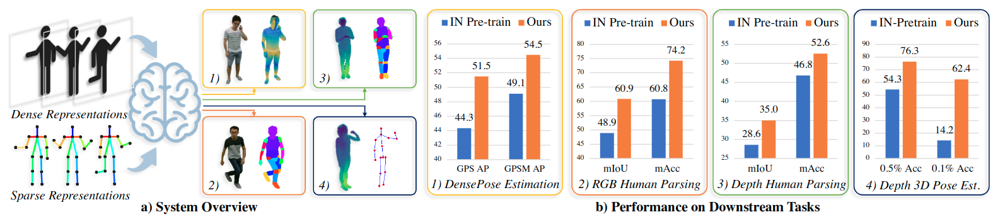

<div align="center">

<h1>Versatile Multi-Modal Pre-Training for<br>Human-Centric Perception</h1>

<div>
    <a href='https://hongfz16.github.io/' target='_blank'>Fangzhou Hong<sup>1</sup></a>&emsp;
    Liang Pan<sup>1</sup>&emsp;
    Zhongang Cai<sup>1,2,3</sup>&emsp;
    <a href='https://liuziwei7.github.io/' target='_blank'>Ziwei Liu<sup>1*</sup></a>
</div>
<div>
    <sup>1</sup>S-Lab, Nanyang Technological University&emsp;
    <sup>2</sup>SenseTime Research&emsp;
    <sup>3</sup>Shanghai AI Laboratory
</div>

<strong>Accepted to <a href='https://cvpr2022.thecvf.com' target='_blank'>CVPR 2022</a> (Oral)</strong>



This repository contains the official implementation of _Versatile Multi-Modal Pre-Training for Human-Centric Perception_. For brevity, we name our method **HCMoCo**.

---

<p align="center">
  <a href="https://arxiv.org/abs/2203.13815" target='_blank'>arXiv</a> •
  <a href="https://hongfz16.github.io/projects/HCMoCo.html" target='_blank'>Project Page</a> •
  <a href="pycontrast/data/NTURGBD-Parsing-4K/README.md" target='_blank'>Dataset</a>
</p>

</div>

## Citation

If you find our work useful for your research, please consider citing the paper:
```
@article{hong2022hcmoco,
  title={Versatile Multi-Modal Pre-Training for Human-Centric Perception},
  author={Hong, Fangzhou and Pan, Liang and Cai, Zhongang and Liu, Ziwei},
  journal={arXiv preprint arXiv:2203.13815},
  year={2022}
}
```


## Updates

[03/2022] Code release!

[03/2022] HCMoCo is accepted to CVPR 2022 for **Oral** presentation:partying_face:!


## Installation

We recommend using conda to manage the python environment. The commands below are provided for your reference.

```bash
git clone git@github.com:hongfz16/HCMoCo.git
cd HCMoCo
conda create -n HCMoCo python=3.6
conda activate HCMoCo
conda install -c pytorch pytorch=1.6.0 torchvision=0.7.0 cudatoolkit=10.1
pip install -r requirements.txt
```

Other than the above steps, if you want to run the PointNet++ experiments, please remember to compile the pointnet operators.

```bash
cd pycontrast/networks/pointnet2
python setup.py install
```


## Dataset Preparation

### 1. NTU RGB-D Dataset

This dataset is for the pre-train process. Download the 'NTU RGB+D 60' dataset [here](https://rose1.ntu.edu.sg/dataset/actionRecognition/). Extract the data to `pycontrast/data/NTURGBD/NTURGBD`. The folder structure should look like:

```
./
├── ...
└── pycontrast/data/NTURGBD/
    ├──NTURGBD/
        ├── nturgb+d_rgb/
        ├── nturgb+d_depth_masked/
        ├── nturgb+d_skeletons/
        └── ...
```

Preprocess the raw data using the following two python scripts which could produce calibrated RGB frames in `nturgb+d_rgb_warped_correction` and extracted skeleton information in `nturgb+d_parsed_skeleton`.

```bash
cd pycontrast/data/NTURGBD
python generate_skeleton_data.py
python preprocess_nturgbd.py
```

### 2. NTURGBD-Parsing-4K Dataset
This dataset is for both the pre-train process and depth human parsing task. Follow the instructions [here](pycontrast/data/NTURGBD-Parsing-4K/README.md) for the preparation of NTURGBD-Parsing-4K dataset.


### 3. MPII Human Pose Dataset

This dataset is for the pre-train process. Download the 'MPII Human Pose Dataset' [here](http://human-pose.mpi-inf.mpg.de/). Extract them to `pycontrast/data/mpii`. The folder structure should look like:

```
./
├── ...
└── pycontrast/data/mpii
    ├── annot/
    └── images/
```

### 4. COCO Keypoint Detection Dataset

This dataset is for both the pre-train process and DensePose estimation. Download the COCO 2014 train/val images/annotations [here](https://cocodataset.org/#download). Extract them to `pycontrast/data/coco`. The folder structure should look like:

```
./
├── ...
└── pycontrast/data/coco
    ├── annotations/
        └── *.json
    └── images/
        ├── train2014/
            └── *.jpg
        └── val2014/
            └── *.jpg
```

### 5. Human3.6M Dataset

This dataset is for the RGB human parsing task. Download the Human3.6M dataset [here](http://vision.imar.ro/human3.6m/description.php) and extract under `HRNet-Semantic-Segmentation/data/human3.6m`. Use the provided script `mp_parsedata.py` for the pre-processing of the raw data. The folder structure should look like:

```
./
├── ...
└── HRNet-Semantic-Segmentation/data/human3.6m
    ├── protocol_1/
        ├── rgb
        └── seg
    ├── flist_2hz_train.txt
    ├── flist_2hz_eval.txt
    └── ...
```


### 6. ITOP Dataset

This dataset is for the depth 3D pose estimation. Download the ITOP dataset [here](https://zenodo.org/record/3932973#.YjXLpH8zZhE) and extract under `A2J/data`. Use the provided script `data_preprocess.py` for the pre-processing of the raw data. The folder structure should look like:

```
./
├── ...
└── A2J/data
    ├── side_train/
    ├── side_test/
    ├── itop_size_mean.npy
    ├── itop_size_std.npy
    ├── bounding_box_depth_train.pkl
    ├── itop_side_bndbox_test.mat
    └── ...
```


## Model Zoo

TBA


## HCMoCo Pre-train

Finally, let's start the pre-training process. We use slurm to manage the distributed training. You might need to modify the below mentioned scripts according to your own distributed training method. We develop HCMoCo based on the [CMC](https://github.com/HobbitLong/CMC) repository. The codes for this part are provided under `pycontrast`.

### 1. First Stage

For the first stage, we only perform 'Sample-level modality-invariant representation learning' for 100 epoch. We provide training scripts for this stage under `pycontrast/scripts/FirstStage`. Specifically, we provide the scripts for training with 'NTURGBD+MPII': `train_ntumpiirgbd2s_hrnet_w18.sh` and 'NTURGBD+COCO': `train_ntucocorgbd2s_hrnet_w18.sh`.

```bash
cd pycontrast
sh scripts/FirstStage/train_ntumpiirgbd2s_hrnet_w18.sh
```

### 2. Second Stage

For the second stage, all three proposed learning targets in HCMoCo are used to continue training for another 100 epoch. We provide training scripts for this stage under `pycontrast/scripts/SecondStage`. The naming of scripts are corresponding to that of the first stage.

### 3. Extract pre-trained weights

After the two-stage pre-training, we need to extract pre-trained weights of RGB/depth encoders for transfering to downstream tasks. Specifically, please refer to `pycontrast/transfer_ckpt.py` for extracting pre-trained weights of the RGB encoder and `pycontrast/transfer_ckpt_depth.py` for that of the depth encoder.


## Evaluation on Downstream Tasks

### 1. DensePose Estimation

The DensePose estimation is performed on COCO dataset. Please refer to [detectron2](https://github.com/facebookresearch/detectron2) for the training and evaluation of DensePose estimation. We provide our config files under `DensePose-Config` for your reference. Fill the config option `MODEL.WEIGHTS` with the path to the pre-trained weights.

### 2. RGB Human Parsing

The RGB human parsing is performed on Human3.6M dataset. We develop the RGB human parsing task based on the [HRNet-Semantic-Segmentation](https://github.com/HRNet/HRNet-Semantic-Segmentation) repository and include the our version in this repository. We provide a config template `HRNet-Semantic-Segmentation/experiments/human36m/config-template.yaml`. Remember to fill the config option `MODEL.PRETRAINED` with the path to the pre-trained weights. The training and evaluation commands are provided below.

```bash
cd HRNet-Semantic-Segmentation
# Training
python -m torch.distributed.launch \
  --nproc_per_node=2 \
  --master_port=${port} \
  tools/train.py \
      --cfg ${config_file}
# Evaluation
python tools/test.py \
    --cfg ${config_file} \
    TEST.MODEL_FILE ${path_to_trained_model}/best.pth \
    TEST.FLIP_TEST True \
    TEST.NUM_SAMPLES 0
```

### 3. Depth Human Parsing

The depth human parsing is performed on our proposed NTURGBD-Parsing-4K dataset. Similarly, the code for depth human parsing is developed based on the [HRNet-Semantic-Segmentation](https://github.com/HRNet/HRNet-Semantic-Segmentation) repository. We provide a config template `HRNet-Semantic-Segmentation/experiments/nturgbd_d/config-template.yaml`. Please refer to the above 'RGB Human Parsing' section for detailed usages.

### 4. Depth 3D Pose Estimation

The depth 3D pose estimation is evaluated on ITOP dataset. We develop the codes based on the [A2J](https://github.com/zhangboshen/A2J) repository. Since the original repository does not provide the training codes, we implemented it by ourselves. The training and evaluation commands are provided below.

```bash
cd A2J
python main.py \
    --pretrained_pth ${path_to_pretrained_weights} \
    --output ${path_to_the_output_folder}
```


## Experiments on the Versatility of HCMoCo

### 1. Cross-Modality Supervision

The experiments for the versatility of HCMoCo are evaluated on NTURGBD-Parsing-4K datasets. For the 'RGB->Depth' cross-modality supervision, please refer to `pycontrast/scripts/Versatility/train_ntusegrgbd2s_hrnet_w18_sup_rgb_cmc1_other1.sh`. For the 'Depth->RGB' cross-modality supervision, please refer to `pycontrast/scripts/Versatility/train_ntusegrgbd2s_hrnet_w18_sup_d_cmc1_other1.sh`.

```bash
cd pycontrast
sh scripts/Versatility/train_ntusegrgbd2s_hrnet_w18_sup_rgb_cmc1_other1.sh
sh scripts/Versatility/train_ntusegrgbd2s_hrnet_w18_sup_d_cmc1_other1.sh
```

### 2. Missing-Modality Inference

Please refer to the provided script `pycontrast/scripts/Versatility/train_ntusegrgbd2s_hrnet_w18_sup_rgbd_cmc1_other1.sh`

```bash
cd pycontrast
sh scripts/Versatility/train_ntusegrgbd2s_hrnet_w18_sup_rgbd_cmc1_other1.sh
```


## License

Distributed under the MIT License. See `LICENSE` for more information.


## Acknowledgements

This work is supported by NTU NAP, MOE AcRF Tier 2 (T2EP20221-0033), and under the RIE2020 Industry Alignment Fund – Industry Collaboration Projects (IAF-ICP) Funding Initiative, as well as cash and in-kind contribution from the industry partner(s).

We thank the following repositories for their contributions in our implementation: [CMC](https://github.com/HobbitLong/CMC), [HRNet-Semantic-Segmentation](https://github.com/HRNet/HRNet-Semantic-Segmentation), [SemGCN](https://github.com/garyzhao/SemGCN), [PointNet2.PyTorch](https://github.com/sshaoshuai/Pointnet2.PyTorch), and [A2J](https://github.com/zhangboshen/A2J).
