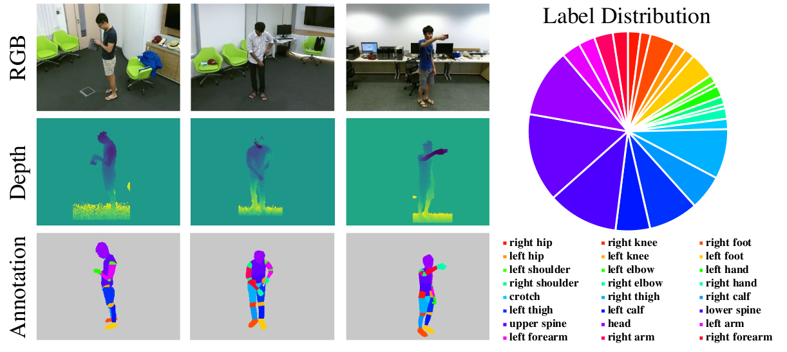

<div align="center">

# NTURGBD-Parsing-4K Dataset

The dataset proposed in **Versatile Multi-Modal Pre-Training for Human-Centric Perception**.



---
</div>

## Collect RGB and depth images

1. Download raw files of both NTU RGB+D 60/120 [here](https://rose1.ntu.edu.sg/dataset/actionRecognition/).
2. Align RGB and depth images using the provided scripts `pycontrast/data/NTURGBD/preprocess_nturgbd.py`. The script is only for NTU RGB+D 60. Some modifications of data paths are required for it to work on NTU RGB+D 120.
3. Collect selected frames according to this file list `pycontrast/data/NTURGBD-Parsing-4K_list.txt`. For each line (e.g. S001C001P001R001A001F060), 'S' is for setup, 'C' is for camera, 'P' is for performer, 'R' is for replication, 'A' is for action, and 'F' is for the frame number. **Note that the frame number is counted from 1.**


## Download the annotations

Here is the [link](https://1drv.ms/u/s!AjLpFg-f48ljgZU0rBpZiLICE8BDgA?e=Ikm4nm) to the annotations.


## Put them together

We put the dataset under `HRNet-Semantic-Segmentation/data/nturgbd`. Here is the recommended folder structure:

```
./
├── ...
└── HRNet-Semantic-Segmentation/data/nturgbd
    ├── png_annotation_v2/
    ├── images/
    ├── depth/
    ├── train_list_v2.txt
    ├── val_list_v2.txt
    ├── train_list_v3.txt
    ├── val_list_v3.txt
    └── ...
```

The `v2` stands for the full training and testing setting. While the `v3` stands for the 20% training and testing setting.


## Example Dataloaders

We provide example dataloaders for our dataset at `HRNet-Semantic-Segmentation/lib/datasets/nturgbd_rgb.py` and `HRNet-Semantic-Segmentation/lib/datasets/nturgbd_d.py`, which corresponds to the dataloaders of RGB and depth respectively.
